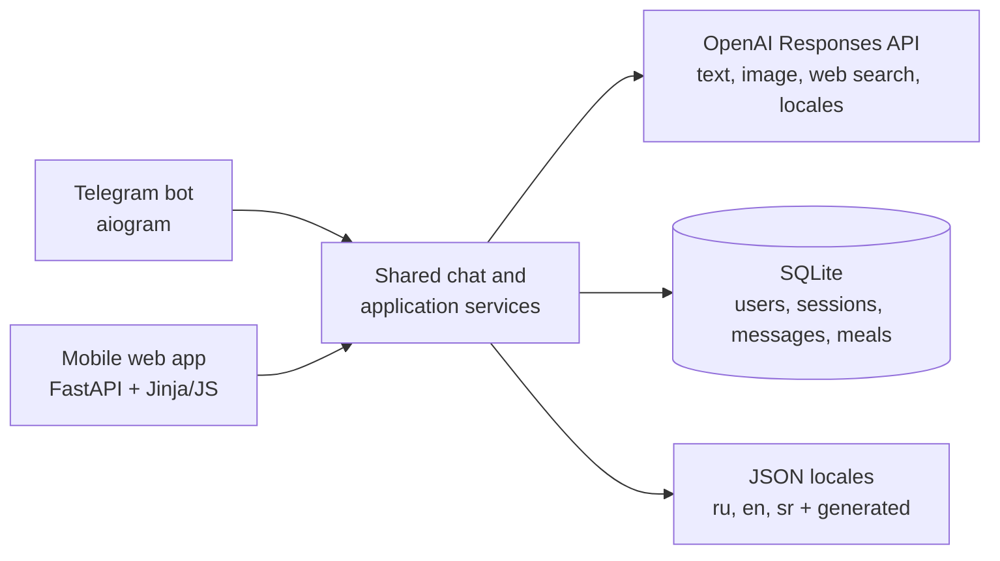

# ChatW8Less

**A Telegram bot + mobile-friendly web app for food tracking, calorie and macro estimates, and everyday nutrition questions.**

I started ChatW8Less for a practical reason: I wanted to lose weight without turning every meal into a spreadsheet, and I wanted to make food tracking easier for my mom. Telegram made logging a meal as simple as sending “70 g chicken, 20 g rice”; the web app came later for the moments when a regular browser is more convenient.

This is a personal side project used by a small real-world audience—not a commercial SaaS. The public repository is a clean version of the original private tool, without personal configuration or usage data.

## At a glance

- **Interfaces:** Telegram bot and responsive web app with shared history
- **OpenAI flows:** structured text parsing, image analysis, web-assisted Q&A, locale generation
- **Backend:** Python 3.11, FastAPI, aiogram 3
- **Storage:** SQLite for users, sessions, messages, settings, and saved meals
- **Delivery:** Docker / Docker Compose and Railway-friendly configuration
- **Product details:** passphrase sessions, model modes, daily limits, assistant naming
- **Localization:** Russian, English, Serbian Latin, plus generated locales
- **Quality:** pytest smoke tests for database, web API, Telegram, localization, and settings flows

## Architecture



## What it does

- Estimates calories and macros from a text meal description.
- Recognizes food from photos and estimates approximate weights.
- Calculates nutrition per 100 g for recipes and mixed dishes.
- Answers product, recipe, grocery, and nutrition questions with online search.
- Saves meals and shows daily, weekly, and all-time nutrition statistics.
- Lets each user focus the interface on calories, protein, carbohydrates, or any combination, with optional daily targets.
- Shares message history and user settings between Telegram and the website.
- Supports user-level nutrition focuses, language, model mode, daily limit, and assistant name.

The assistant keeps a small, dedicated conversation context for natural follow-ups, while calorie-parsing requests remain isolated so earlier meals do not leak into a new calculation.

## Project structure

```text
bot/
  app_services.py      # application-level nutrition, online, locale, import flows
  chat_service.py      # shared chat/history flows for web and Telegram
  db.py                # SQLite schema, migrations, users, sessions, meals
  handlers.py          # Telegram command/message handlers
  i18n.py              # locale loading, fallback, generated locales
  openai_client.py     # OpenAI API wrappers
  telegram_app.py      # bot setup and command registration
locales/               # built-in ru, en, sr translations
static/                # browser JavaScript, CSS, favicon
templates/             # Jinja web UI
tests/test_smoke.py
web_app.py             # FastAPI app and web API
manage_users.py        # user-management CLI
```

## Local setup

Copy the example configuration and install the development dependencies:

```bash
cp .env.example .env
pip install -r requirements-dev.txt
```

Required variables:

```env
OPENAI_API_KEY=...
TELEGRAM_API_TOKEN=...
ALLOWED_USER_IDS=123456789,987654321
SITE_URL=https://your-app.example.com
```

Start the shared web + bot backend:

```bash
uvicorn web_app:app --host 127.0.0.1 --port 8000 --reload
```

Then open `http://127.0.0.1:8000/`. If `TELEGRAM_API_TOKEN` is configured and `RUN_TELEGRAM_IN_WEB=true`, Telegram polling starts in the same process. For Telegram-only mode, run `python main.py`.

## User management

Create a Telegram-linked user:

```bash
python manage_users.py create --name "Family User" --telegram-id 123456789 --phrase "secret passphrase" --language ru
```

Create a web-only user:

```bash
python manage_users.py create --name "Guest" --phrase "another secret passphrase" --language en
```

Other commands:

```bash
python manage_users.py list
python manage_users.py set-phrase --user-id 123456789 --phrase "new secret passphrase"
```

Only passphrase hashes are stored.

## Docker and deployment

Build and run locally:

```bash
docker compose up --build
```

The compose file mounts `./storage` and `./logs`; neither belongs in Git. For Railway or another container host, use a persistent volume and point `DATABASE_PATH` inside it.

Recommended production settings:

```env
DATABASE_PATH=/app/storage/chatw8less.sqlite3
WEB_COOKIE_SECURE=true
RUN_TELEGRAM_IN_WEB=true
```

To keep an old host online as a migration landing page, set only the target
address and disable Telegram polling:

```env
MIGRATION_TARGET_URL=https://new-site.example.com
RUN_TELEGRAM_IN_WEB=false
```

Migration mode does not initialize the database or start Telegram polling.
The home page shows a move notice and button, while other application routes
redirect to the new site using `303 See Other`.

## Tests

```bash
pytest
```

The smoke suite covers database migrations, web login and API flows, shared history, meal saving, settings, Telegram behavior, localization, and assistant context.

## Security

- Never commit `.env`, SQLite databases, logs, or `storage/`.
- Keep `ALLOWED_USER_IDS` restricted for private/family use.
- Use secure cookies behind HTTPS and persistent storage in production.
- Rotate Telegram and OpenAI keys if they are ever committed or shared.

See [SECURITY.md](SECURITY.md) for reporting guidance.

## Author

[Dmitrii Gorlov](https://github.com/dmitriygorlov) · [LinkedIn](https://www.linkedin.com/in/ds-marketer)

## License

MIT

